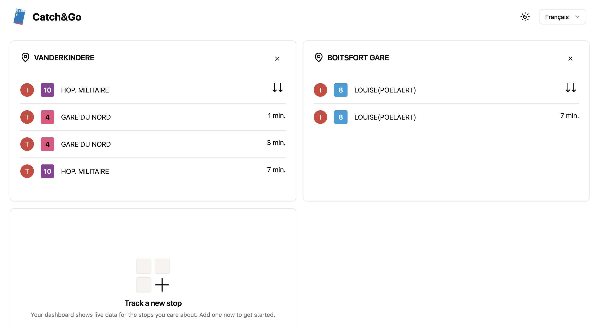

## catch-and-go

I built **Catch and Go** initially as a way to **learn Golang**, and then I wanted to have a frontend to interact with the data. Since I mostly work with React recently, I decided to try something different and use **htmx** to keep the frontend simple while still leveraging Go for rendering.  

The project allows users to **add bus, tram, or metro stops** to their personal dashboard, giving a single view of the multiple ways they can commute around their area.

### Features

- Available in **French** and **Dutch**
- Supports **dark and light mode**
- Quick and interactive with **htmx**
- Easy to extend and run locally
- Personalized dashboard for multiple stops

### Screenshot



## Tech Stack

- **STIB API** - the STIB / MIVB open api
- **SQLite** — lightweight database
- **Go Blueprint** — project scaffolding
- **Goose** — migration manager
- **sqlc** — type-safe SQL to Go code
- **Golang + Echo** — backend framework
- **HTMX + Templ** — frontend rendering and interactivity
- **Tailwind + TemplUI** — styling and component library

## MakeFile

Run build make command with tests
```bash
make all
```

Seed the application
```bash
make seed
```

Build the application
```bash
make build
```

Run the application
```bash
make run
```

Live reload the application:
```bash
make watch
```

Run the test suite:
```bash
make test
```

Clean up binary from the last build:
```bash
make clean
```
